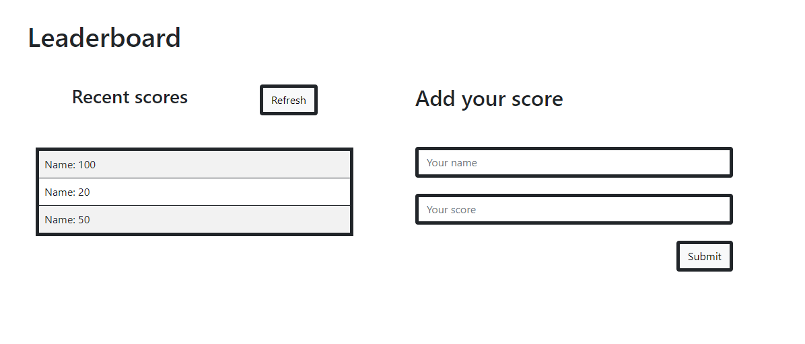

## Leaderboard ##

> The leaderboard website displays scores submitted by different players. It also allows you to submit your score. All data is preserved thanks to the external Leaderboard API service. For this branch the priority is to create a working version of the leaderboard on the next features the styling and use of the API will be implemented.

Additional description about the project and its features.

## Built With

- HTML, CSS, JS
- Linterns, Gitflow
- Flexbox, Webpack

## Getting Started

### Prerequisites
You will need an up to date browser to render this website. Also npm to run terminal commands.

### Setup and Install
To get a local copy up and running follow these simple example steps. You can either download the zip file, or clone the repository from [here](https://github.com/herokudev/Leaderboard-scores/tree/basic-page-structure) 

### Usage
To test the app locally, use Live Server (Extension for VS Code)

## Authors (Github: Herokudev)
Herbert Orellana

- GitHub: [@herokudev](https://github.com/herokudev)
- LinkedIn: [LinkedIn](https://www.linkedin.com/in/herbert-armando-orellana-a0b50b34/)

## 🤝 Contributing
Contributions, issues, and feature requests are welcome!

Show your support
Give a ⭐️ if you like this project!

## 📝 License 
This project is MIT licensed.
